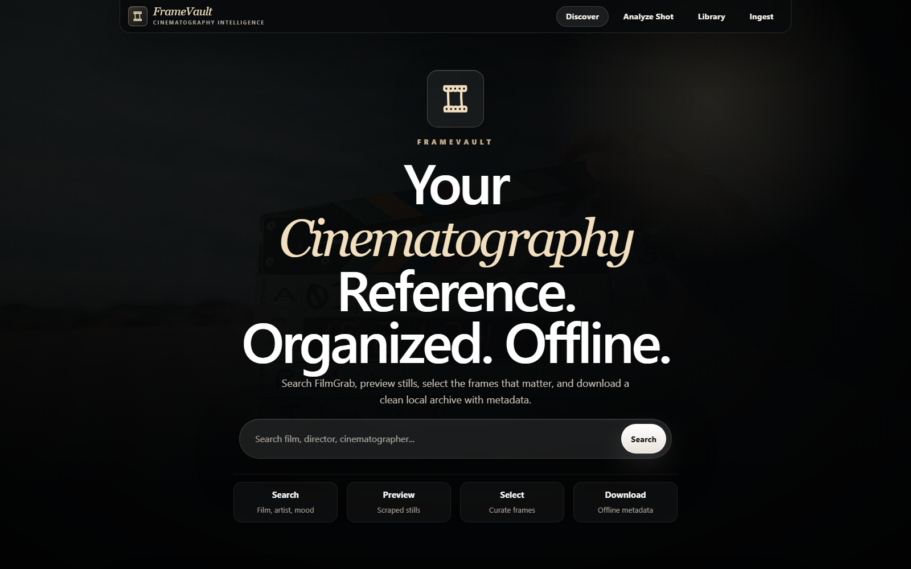
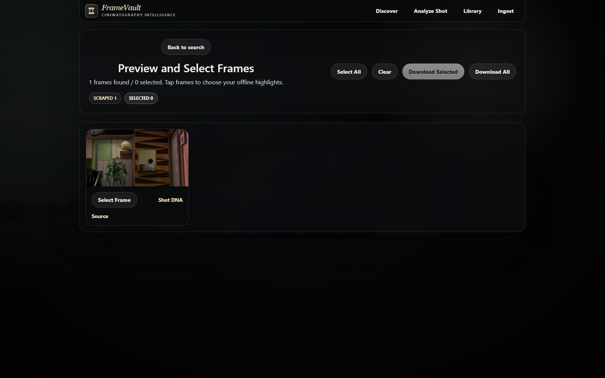
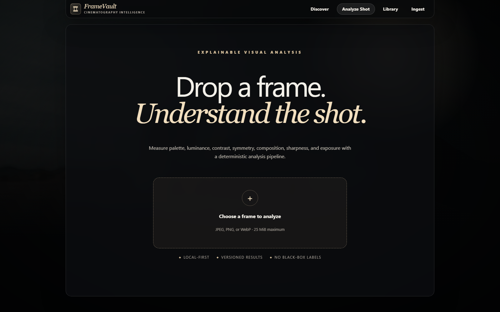
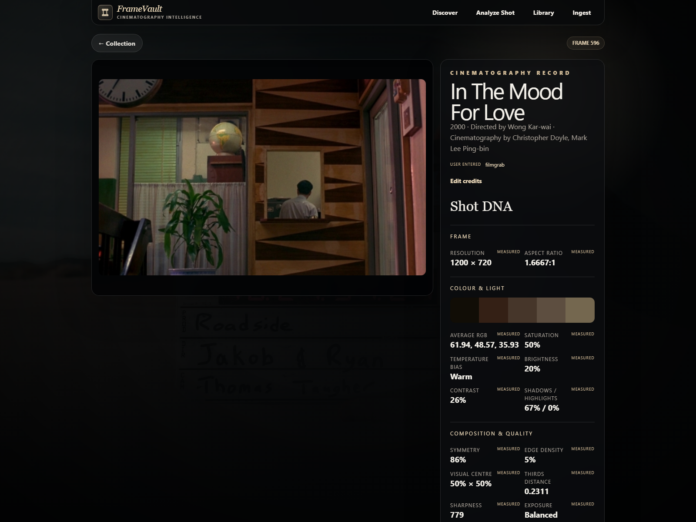
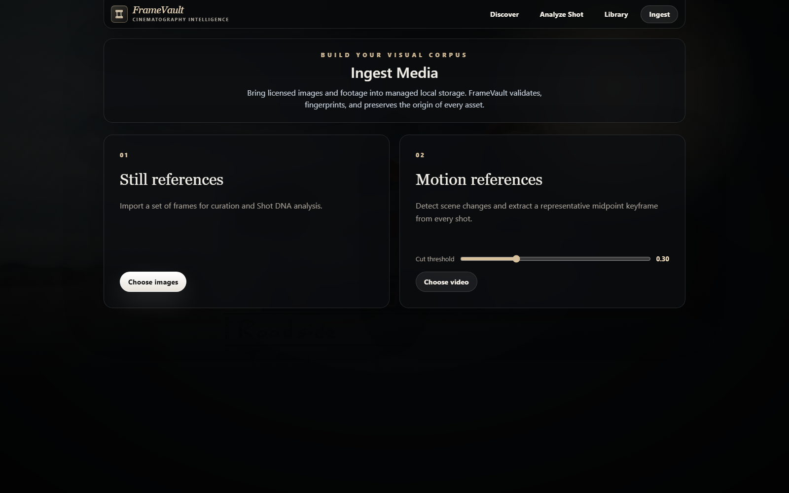
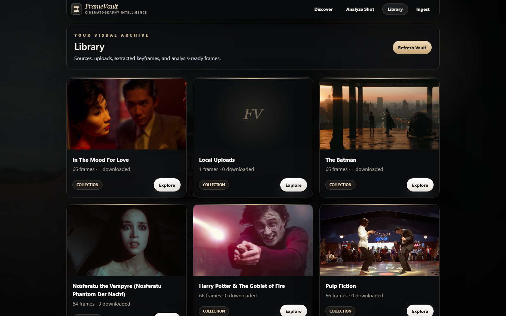

# FrameVault

FrameVault is a local-first cinematography reference engine for collecting, organizing, and analyzing film frames.

It started as a small FilmGrab scraper because I wanted a better way to build a personal cinematography reference library without manually saving frames into folders. It has since grown into a broader visual reference tool: FrameVault can discover frames from FilmGrab, ingest local images and video, organize them into a local archive, and run deterministic visual analysis on individual shots.

The emphasis is deliberately on transparent image measurements rather than generated descriptions. Shot analysis is based on properties that can be measured directly from the image — palette, luminance, contrast, symmetry, composition, sharpness, exposure, and related statistics.

Everything is stored locally with its source and metadata intact.

## Screenshots

### Discover

Search FilmGrab by film, director, cinematographer, or other reference terms.



### Search Results

FilmGrab results are surfaced as visual cards before anything is added to the local archive.


### Frame Curation

Preview the frames found for a film, select individual references, or download the complete set.



### Analyze Shot

Local images can also be analyzed directly without first creating a FilmGrab collection.



### Shot DNA

Each frame gets a deterministic visual profile based on measurements taken from the image.



### Media Ingest

Images and video can be brought into the same local corpus. Video ingestion detects shot boundaries and extracts representative keyframes.



### Library

Downloaded collections, local uploads, and extracted frames live in one local archive.



### Frame Detail

Individual frames retain their film/source information alongside their visual analysis.


---

## What FrameVault Does

FrameVault currently has four main workflows:

```text
Discover
   ↓
FilmGrab search
   ↓
Scrape frames
   ↓
Preview + curate
   ↓
Download
   ↓
Local Library
```

```text
Local Image
   ↓
Ingest
   ↓
Fingerprint
   ↓
Store provenance
   ↓
Shot DNA
```

```text
Local Video
   ↓
FFmpeg / FFprobe
   ↓
Shot-boundary detection
   ↓
Representative keyframes
   ↓
Local Library
   ↓
Shot DNA
```

```text
Library Frame
   ↓
Open frame
   ↓
Measured visual properties
   ↓
Cinematography record
```

The goal is to make collecting references and studying why a frame looks the way it does part of the same workflow.

## Features

### Film discovery and curation

- Search FilmGrab by film title, director, cinematographer, or keyword.
- Display matching FilmGrab posts with thumbnails and source information.
- Scrape still images from a selected film page.
- Preview discovered frames before downloading anything.
- Select individual frames for a smaller reference set.
- Download selected frames or an entire collection.
- Keep the original FilmGrab source attached to the collection.

### Local visual library

- Browse FilmGrab collections and locally ingested media together.
- Organize downloaded frames into local collections.
- Track source URLs and local paths.
- Store metadata in SQLite rather than relying on filenames alone.
- Preserve provenance for imported assets.
- Avoid duplicate records and unnecessary duplicate downloads.
- Open individual frames as cinematography records.

### Image ingestion

FrameVault is not limited to FilmGrab.

Local still images can be imported directly into the vault. During ingestion the backend validates the asset, generates a fingerprint, records its origin, and makes the frame available to the same analysis pipeline used by downloaded references.

SHA-256 fingerprints are used to identify assets and prevent the same media from being silently added repeatedly.

### Video ingestion

FrameVault can also build references from video.

Instead of treating an entire video as one asset, the ingestion pipeline uses FFmpeg/FFprobe to detect scene changes and extract a representative midpoint keyframe from each detected shot.

The cut threshold can be adjusted before ingestion.

```text
video
  ↓
probe media
  ↓
detect scene changes
  ↓
construct shot ranges
  ↓
extract midpoint keyframe
  ↓
fingerprint + persist
  ↓
analysis-ready frame
```

This makes it possible to turn footage into a searchable visual corpus without manually taking screenshots.

## Shot DNA

Shot DNA is FrameVault's explainable visual-analysis layer.

Rather than asking a model to label a frame as something like *moody*, *beautiful*, or *cinematic*, the current pipeline measures properties directly from the pixels.

Current analysis includes:

- image resolution
- aspect ratio
- dominant colour palette
- average RGB
- saturation
- brightness / luminance
- warm/cool temperature bias
- contrast
- shadow percentage
- highlight percentage
- horizontal symmetry
- visual centre
- rule-of-thirds distance
- edge density
- sharpness
- exposure classification

For example, a frame record can contain measurements such as:

```text
Resolution          1200 × 720
Aspect Ratio        1.6667:1

Average RGB         61.94, 48.57, 35.93
Saturation          50%
Temperature Bias    Warm
Brightness          20%
Contrast            26%
Shadows             67%
Highlights          0%

Symmetry            86%
Visual Centre       50% × 50%
Thirds Distance     0.2311
Edge Density        5%
Sharpness           779
Exposure            Balanced
```

The important distinction is that these values are **measured**, not generated as black-box labels.

That gives FrameVault a useful foundation for later semantic or ML-assisted features while keeping the underlying visual record reproducible.

## Analysis Versioning

Visual analysis is versioned.

This matters because an analysis algorithm will inevitably change as the project develops. Re-running a newer algorithm should not make it impossible to determine how an older result was produced.

FrameVault therefore treats an analysis result as data with an associated algorithm/version rather than as a permanent property written directly onto a frame.

Conceptually:

```text
Frame
 ├── source / provenance
 ├── fingerprint
 └── analyses
      ├── analysis v1
      ├── analysis v2
      └── ...
```

This also makes it possible to compare implementations later instead of silently replacing previous results.

## Tech Stack

### Backend

- Python
- FastAPI
- Pydantic
- Requests
- BeautifulSoup
- SQLite
- Pillow / image-processing utilities
- FFmpeg
- FFprobe
- local filesystem storage

### Frontend

- React
- Vite
- React Router
- Tailwind CSS
- Axios

### Persistence

- SQLite for structured metadata
- local filesystem for original/downloaded media
- JSON sidecar metadata for downloaded FilmGrab collections
- SHA-256 fingerprints for ingested assets

### Development

- Pytest
- frontend build checks
- GitHub Actions CI

## Architecture

The project is split so that HTTP routes, ingestion, persistence, analysis, and external-source scraping do not have to know too much about one another.

```text
FrameVault
├── backend/
│   └── app/
│       ├── main.py
│       │
│       ├── models/
│       │   └── schemas.py
│       │
│       ├── scraper/
│       │   └── filmgrab.py
│       │
│       ├── services/
│       │   ├── download_service.py
│       │   ├── ingestion/
│       │   └── analysis/
│       │
│       ├── repositories/
│       │   ├── frames
│       │   ├── media
│       │   ├── analyses
│       │   ├── shots
│       │   └── jobs
│       │
│       └── db/
│           └── database.py
│
├── frontend/
│   └── src/
│       ├── api/
│       ├── components/
│       ├── pages/
│       │   ├── Discover
│       │   ├── Curator
│       │   ├── Analyze Shot
│       │   ├── Ingest
│       │   ├── Library
│       │   └── Frame Detail
│       └── ...
│
├── data/
│   └── local SQLite data
│
├── storage/
│   └── locally managed media
│
├── ss/
│   └── README screenshots
│
└── tests/
```

The exact module layout will continue to change as the ingestion and analysis layers grow, but the main separation is intentional:

```text
Routes
   ↓
Services
   ↓
Repositories
   ↓
SQLite / Filesystem
```

External sources and media processors sit beside that pipeline:

```text
FilmGrab ──→ scraper ───────┐
                            │
Images ────→ ingestion ─────┼──→ repositories
                            │
Video ─────→ FFmpeg ────────┘

Frame ─────→ analysis ─────────→ versioned analysis record
```

## FilmGrab Workflow

### 1. Search

The frontend sends a search request to the backend:

```text
GET /api/search?q=<query>
```

FrameVault requests the FilmGrab search page and parses its WordPress result cards.

The useful parts of a result are normalized into a small internal representation:

```json
{
  "title": "Blade Runner",
  "url": "https://film-grab.com/2010/06/23/blade-runner/",
  "excerpt": "[Ridley Scott • 1982]",
  "thumbnail_url": "https://film-grab.com/..."
}
```

FilmGrab is treated as an external source rather than as FrameVault's database. The original page URL remains attached to the resulting collection.

### 2. Scrape

Selecting a result sends its FilmGrab page to the scraper.

Current FilmGrab galleries expose full-size images through gallery markup, with fallback extraction for alternative image attributes when necessary.

The scraper:

1. fetches the film page;
2. extracts candidate image URLs;
3. normalizes them;
4. removes duplicates;
5. creates or updates the film record;
6. stores the discovered frame metadata.

The scraper intentionally uses fallback selectors because FilmGrab's page structure is outside FrameVault's control and can change.

### 3. Curate

The discovered frames are shown before downloading.

Frames can be selected individually, cleared, selected in bulk, or downloaded as a complete collection.

This keeps discovery separate from local storage: searching for a film does not automatically fill the machine with every frame returned by the source.

### 4. Download

When a collection is downloaded, FrameVault:

1. reads the stored film/frame records;
2. creates a safe local collection directory;
3. downloads the original image sources;
4. avoids downloading an existing asset unnecessarily;
5. records the resulting local path;
6. writes collection metadata.

A collection looks roughly like:

```text
storage/
└── selected/
    └── Blade Runner/
        ├── blade-runner-001.jpg
        ├── blade-runner-002.jpg
        └── metadata.json
```

The sidecar metadata keeps the local files traceable back to their source.

## Local Ingestion

FilmGrab is only one adapter into the system.

For a local still:

```text
Image
  ↓
validate
  ↓
fingerprint
  ↓
persist media
  ↓
create frame
  ↓
analyze
```

For video:

```text
Video
  ↓
FFprobe
  ↓
FFmpeg scene detection
  ↓
shot ranges
  ↓
midpoint keyframes
  ↓
fingerprint
  ↓
persist
  ↓
analyze
```

This separation is important because the library should not care whether a frame originally came from FilmGrab, an uploaded image, or an extracted video keyframe.

## Data Model

The application has gradually moved away from treating a downloaded JPEG as the complete record.

The useful relationships are closer to:

```text
Media Asset
   │
   ├── provenance
   ├── fingerprint
   └── frames
        │
        ├── shot information
        └── analyses
```

FilmGrab collections add source/film information around those frames, while locally ingested media retains its own provenance.

Repository modules isolate this persistence logic from the API and analysis code.

## Local Storage and Provenance

FrameVault is designed around local ownership of the reference corpus.

Downloaded or ingested assets retain enough information to answer:

- Where did this frame come from?
- Is it a FilmGrab reference or a local asset?
- Where is the local file?
- Has this asset already been ingested?
- Which shot did an extracted keyframe represent?
- Which analysis version produced these measurements?

This is one reason the project uses both a relational database and normal files rather than hiding everything behind an opaque asset store.

## API

The API has expanded beyond the original search/scrape/download endpoints.

Core endpoint groups cover:

```text
/health

/api/search
/api/scrape

/api/films
/api/films/{film_id}/images
/api/images/{image_id}/select

/api/download/selected
/api/download/all

/api/media
/api/frames
/api/shots
/api/analysis
/api/jobs
```

The exact route surface is still evolving as ingestion and analysis are developed, so the FastAPI-generated documentation is the best reference for the currently available request and response schemas.

When the backend is running, FastAPI exposes the interactive API documentation at:

```text
http://127.0.0.1:8001/docs
```

## Running Locally

### Requirements

You will need:

- Python 3
- Node.js / npm
- FFmpeg and FFprobe available on your system

Clone the repository and create the Python environment:

```powershell
git clone https://github.com/easyvansh/framevault.git
cd framevault

python -m venv .venv
.\.venv\Scripts\python.exe -m pip install -r backend\requirements.txt
```

Install the frontend dependencies:

```powershell
cd frontend
npm install
```

### Start the backend

From the repository root:

```powershell
.\.venv\Scripts\python.exe -m uvicorn app.main:app --host 127.0.0.1 --port 8001 --app-dir backend
```

### Start the frontend

In another terminal:

```powershell
cd frontend
npm run dev
```

Open:

```text
http://127.0.0.1:5173
```

## Testing

Backend tests can be run with:

```powershell
pytest
```

The frontend production build can be checked with:

```powershell
cd frontend
npm run build
```

CI runs automated checks on repository changes so the ingestion/analysis work does not quietly break the original FilmGrab workflow.

## Engineering Decisions

A few constraints have shaped the project.

### Local first

FrameVault is currently intended as a single-user local tool.

The SQLite database and filesystem are deliberately visible and portable rather than hidden behind a hosted service.

### Provenance over convenience

A cinematography reference is more useful when its origin is known.

Source information therefore stays attached to FilmGrab frames and locally ingested media rather than being discarded once an image reaches the library.

### Deterministic analysis before ML

The first visual-analysis layer uses reproducible image measurements.

This makes the output inspectable and gives future ML features a known baseline to build on.

### Separate ingestion from analysis

Getting media into the system and understanding that media are different problems.

An ingestion adapter should produce a valid frame regardless of whether the source was FilmGrab, an uploaded image, or video. Analysis can then operate on that common representation.

### Version analysis results

Image-analysis algorithms change.

Keeping analysis results versioned makes those changes observable instead of silently changing the meaning of previously stored measurements.

### Treat external markup as unstable

FilmGrab is an external website.

Scraping logic therefore uses normalized URLs, fallback selectors, timeouts, and isolated scraper code instead of allowing assumptions about FilmGrab's HTML to spread throughout the application.

## Current Limitations

FrameVault is still an active personal project rather than a finished production service.

Some current limitations are intentional:

- FilmGrab scraping depends on third-party page structure.
- The application is single-user.
- Storage is local.
- SQLite is used instead of a network database.
- Shot-boundary detection is heuristic and depends on the selected threshold.
- Shot DNA describes measurable visual properties; it does not yet understand semantic concepts such as character, location, narrative context, or emotion.
- There is not yet a vector index for similarity or natural-language retrieval.

Those last two points are the next interesting part of the project.

## Next

The ingestion and deterministic-analysis foundation makes several larger features possible without changing the underlying archive model.

Areas I want to explore next include:

- CLIP/OpenCLIP embeddings for semantic frame retrieval
- natural-language cinematography search
- visual similarity search
- vector indexing with Qdrant or pgvector
- richer composition analysis
- shot-scale estimation
- scene and location classification
- automatic moodboard generation
- comparison views for directors and cinematographers
- analysis-history comparison
- corpus-level visual statistics
- evaluation datasets for retrieval and analysis quality

A query could eventually look like:

```text
warm symmetrical interiors with characters isolated by architecture
```

and return relevant frames from the user's own local corpus.

The difference is that semantic retrieval would sit on top of the existing provenance, ingestion, and measurable Shot DNA layers rather than replacing them.

## Why I Built It

I study both computing science and film, and I wanted a project where those two areas were part of the same problem rather than simply putting a film-themed interface on top of an unrelated software project.

Cinematography references are usually scattered between screenshots, bookmarks, FilmGrab pages, folders, and moodboards. FrameVault is an attempt to turn that process into a small piece of software infrastructure:

**find the frame → preserve the source → keep it locally → measure it → find it again.**

---

FrameVault is built for personal reference and study. Film stills remain the property of their respective copyright holders, and FilmGrab is an external source unaffiliated with this project.