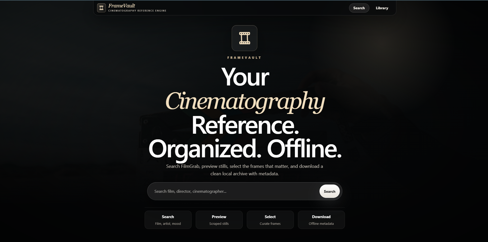
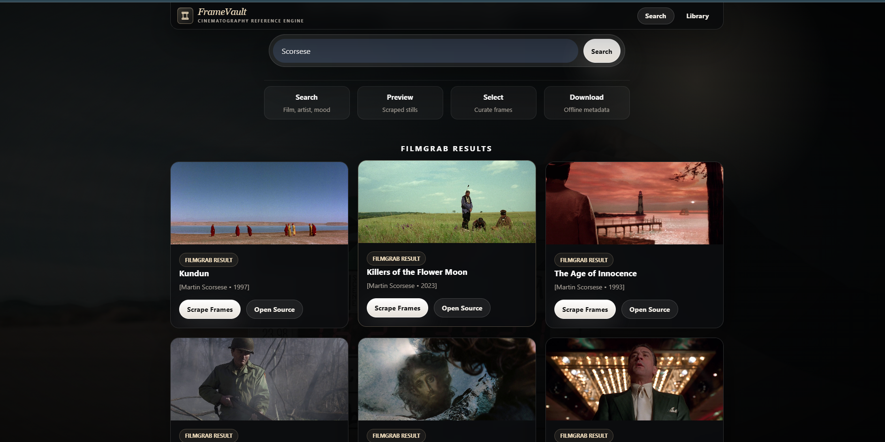
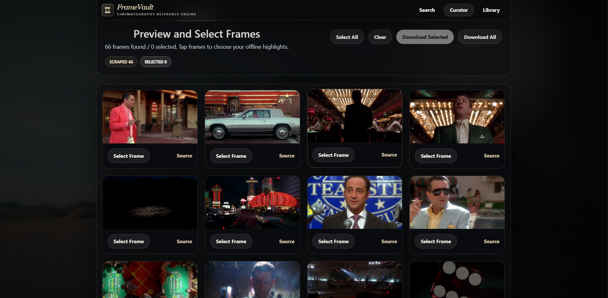

# FrameVault

FrameVault is a local-first cinematography intelligence engine. It collects visual references from FilmGrab or local uploads, preserves their provenance, computes deterministic Shot DNA, and turns uploaded video into persisted shots with representative keyframes.

It is designed as both a useful reference workflow for filmmakers and a systems project spanning full-stack engineering, media ingestion, computer vision, and data modelling.

## What works today

- Search and ingest FilmGrab reference frames.
- Upload JPEG, PNG, and WebP images with validation and SHA-256 deduplication.
- Upload MP4, MOV, MKV, and WebM video; inspect it with FFprobe.
- Detect video cuts with FFmpeg scene scores and extract one midpoint keyframe per shot.
- Persist media assets, provenance, shots, keyframes, and analysis versions in SQLite.
- Re-ingest sources without losing frame identity, selection, or download metadata.
- Analyze frames for colour, luminance, composition, sharpness, and exposure.
- Navigate through shareable collection and frame URLs with React Router.
- Upload a single frame through Analyze Shot and move directly into its report.
- Inspect Shot DNA on a dedicated, responsive frame-detail light table.
- Process video and open every extracted shot keyframe directly from the ingest workflow.
- Download selected or complete reference sets with JSON sidecar metadata.

## Capability boundaries

| Capability | Status | Provenance |
|---|---|---|
| Film and frame ingestion | Available | Source-backed |
| Video cuts and keyframes | Available | FFmpeg-measured |
| Colour, light, composition, quality | Available | Pixel-measured |
| Dominant line orientation | Experimental | Classical heuristic with confidence |
| Director and cinematographer credits | Available when entered | Source/user metadata |
| Shot scale and camera elevation | Returns unknown without reliable evidence | Experimental |
| Camera, lens, focal length, aperture | Not inferred | Source/manual only |
| Semantic search and similar frames | Planned | Not shown in the UI |

## Screenshots

<p align="center"><strong>Home</strong><br /></p>
<p align="center"><strong>Search</strong><br /></p>
<p align="center"><strong>Curation</strong><br /></p>

## Architecture

```text
React / Vite
    |
FastAPI application
    |-- domain routers: health, films, frames, ingestion
    |-- ingestion: FilmGrab, images, video
    |-- services: downloads, Shot DNA, shot extraction
    |-- vision: deterministic image-analysis pipeline
    `-- repositories: films, frames, media, analyses, shots, jobs
            |
          SQLite + managed local storage
```

The FastAPI entry point only configures the application lifecycle, CORS, static storage, and router registration. Domain work lives in routers, services, ingestion adapters, and repositories. The frontend uses explicit routes for discovery, collections, frames, analysis, ingestion, and the library rather than hiding product state inside one component.

### Media pipeline

```text
image upload --> validate --> hash --> deduplicate --> Frame --> Shot DNA

video upload --> FFprobe --> MediaAsset --> scene detection --> Shot
                                                    `--> midpoint keyframe --> Frame --> Shot DNA
```

Shot detection is deterministic and configurable with `FRAMEVAULT_SHOT_THRESHOLD` (default `0.30`). Lower values create more cuts; higher values require stronger visual changes.

## Shot DNA

The classical analyzer produces explainable, versioned measurements:

- dimensions and aspect ratio;
- mean RGB, saturation, dominant palette, and colour-temperature bias;
- brightness, contrast, luminance percentiles, shadows, and highlights;
- edge density, bilateral symmetry, visual centre, and rule-of-thirds proximity;
- sharpness plus underexposure and overexposure flags.

Each run records the analyzer name, analyzer version, execution time, status, and result payload so later ML analyzers can coexist without erasing prior results.

## API

```text
GET  /health
GET  /api/search?q=<query>
POST /api/scrape
GET  /api/films
GET  /api/films/{film_id}/frames
GET  /api/films/{film_id}/images              compatibility route
GET  /api/frames/{frame_id}
POST /api/frames/{frame_id}/select
POST /api/images/{frame_id}/select             compatibility route
POST /api/frames/{frame_id}/analysis
GET  /api/frames/{frame_id}/analysis
POST /api/ingestion/images
POST /api/ingestion/videos
POST /api/media-assets/{asset_id}/shots?threshold=0.30
GET  /api/media-assets/{asset_id}/shots
POST /api/download/selected
POST /api/download/all
```

## Run locally

Requirements: Python 3.11+, Node.js 18+, and FFmpeg/FFprobe on `PATH` for video features.

```powershell
python -m venv .venv
.\.venv\Scripts\python.exe -m pip install -r backend\requirements.txt
.\.venv\Scripts\python.exe -m uvicorn app.main:app --host 127.0.0.1 --port 8001 --app-dir backend
```

In a second terminal:

```powershell
cd frontend
npm install
npm run dev
```

Open `http://127.0.0.1:5173`. Runtime data is written to gitignored `data/` and `storage/` directories.

After installing dependencies, Windows users can start both services with `./start-framevault.ps1`.

### Configuration

| Variable | Default | Purpose |
|---|---:|---|
| `FRAMEVAULT_ALLOWED_ORIGINS` | local Vite origins | Comma-separated CORS origins |
| `FRAMEVAULT_MAX_UPLOAD_BYTES` | 25 MiB | Image upload limit |
| `FRAMEVAULT_MAX_VIDEO_UPLOAD_BYTES` | 2 GiB | Video upload limit |
| `FRAMEVAULT_FFMPEG_PATH` | `ffmpeg` | FFmpeg executable |
| `FRAMEVAULT_FFPROBE_PATH` | `ffprobe` | FFprobe executable |
| `FRAMEVAULT_SHOT_THRESHOLD` | `0.30` | Scene-change sensitivity |

## Tests

```powershell
.\.venv\Scripts\python.exe -m pip install -r backend\requirements-dev.txt
.\.venv\Scripts\python.exe -m pytest backend\tests
```

The suite covers schema migration, nondestructive re-ingestion, image/video ingestion, route compatibility, Shot DNA persistence, and video shot/keyframe extraction.

Every push and pull request runs the backend suite and a clean frontend production build through GitHub Actions.

## Roadmap

1. Versioned OpenCLIP embeddings and visual similarity.
2. Semantic text search with simple Shot DNA filters.
3. PostgreSQL/object storage adapters and public deployment.
4. A small retrieval-quality evaluation.

FrameVault does not yet claim semantic or vector search; those remain roadmap items.

## Responsible use

FrameVault keeps source URLs and provenance, avoids silent duplicate records, and treats FilmGrab parsing as an unstable external integration. Users are responsible for respecting source-site terms and image rights.

## Recruiter demo assets

Before publishing the portfolio, replace or supplement the legacy screenshots with: Discover, Analyze Shot, completed Shot DNA, video shot timeline, and Library. Record a 30–45 second demo showing a legal clip becoming shots, a keyframe, and a measured report. Store final images under `ss/` and link the hosted demo video near the top of this README.
